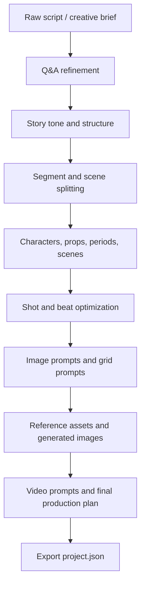

# manju-ai-workflow

[](LICENSE)
[](https://www.python.org/)
[](https://streamlit.io/)

AI Q&A workflow system for turning a raw story, script, or creative brief into structured manga / storyboard production data.

`manju-ai-workflow` focuses on two ideas:

- **Q&A driven refinement**: use guided questions to clarify tone, structure, characters, scenes, assets, and production intent before generating final prompts.
- **Process-first production**: move from raw script to segments, beats, characters, scene assets, shot fields, image prompts, grid prompts, and video prompts through a repeatable workflow.

## What It Does

- Converts raw scripts or creative briefs into structured story data.
- Uses question-answer loops to refine story tone, segment structure, scene logic, and character details.
- Extracts characters, scenes, props, periods, beats, and visual references.
- Generates image prompts for characters, scenes, props, storyboard panels, and shot-level images.
- Optimizes shot fields for manga, storyboard, and AI video production.
- Provides Streamlit workspaces for the original production flow and a newer director-style workflow.
- Integrates optional image/video backends such as LLM chat APIs, GRS-style image APIs, PoloAI video APIs, and ComfyUI.

## Workflow



## Main Apps

```powershell
streamlit run app.py
```

Runs the full original manga engineering workflow.

```powershell
streamlit run director_app/app.py
```

Runs the newer director workbench, organized around overview, script, assets, storyboard, and final render stages.

```powershell
streamlit run director_app/director_workbench.py
```

Runs the prompt-first director workbench experiment.

## Repository Layout

```text
app.py                         Original Streamlit workflow app
director_app/                  New director-style Streamlit workspace
state/                         Project schema, migration, import/export helpers
script_analyzer.py             Raw script analysis and initial extraction
script_refine.py               Q&A and script refinement pipeline
script_parser.py               Scene, beat, grid, and asset parsing
asset_manager.py               Character, scene, prop, and reference asset tools
shot_optimizer.py              Shot-field generation and optimization
grid_generator.py              Manga grid / panel prompt generation
video_prompter.py              Video prompt generation for final production
llm.py                         LLM chat API wrapper
image_gen.py                   Image generation wrapper
video_gen.py                   Video generation wrapper
comfyui_api.py                 Optional ComfyUI integration
cfui_wf/                       Example ComfyUI workflow JSON files
```

## Quick Start

```powershell
python -m venv .venv
.\.venv\Scripts\Activate.ps1
pip install -r requirements.txt
Copy-Item .env.example .env
streamlit run app.py
```

Fill `.env` only for the providers you want to use. The app can still be studied and extended without committing any provider credentials.

## Configuration

```env
YUNWU_API_KEY=
YUNWU_CHAT_BASE_URL=https://yunwu.ai/v1/chat/completions
YUNWU_TEXT_MODEL=gpt-5.1

GRSAI_API_KEY=
GRSAI_BASE_URL=https://grsaiapi.com
MANJU_IMAGE_RELAY_BASE_URL=

POLOAI_API_KEY=
POLOAI_HOST=https://poloai.top
MANJU_IMAGE_UPLOAD_SERVER=

COMFYUI_URL=http://127.0.0.1:8188
COMFYUI_INPUT_DIR=
COMFYUI_OUTPUT_DIR=
COMFYUI_CLOUD_BASE=
COMFYUI_WORKFLOW_ID=
```

The open-source release intentionally excludes real API keys, private relay servers, generated images, videos, debug JSON snapshots, logs, local project states, and backup folders.

## Suggested GitHub Topics

`ai-workflow`, `qa-system`, `script-analysis`, `storyboard`, `manga`, `ai-comics`, `prompt-engineering`, `streamlit`, `llm`, `image-generation`, `video-generation`, `comfyui`, `creative-tools`, `storytelling`, `workflow-automation`

## Keywords

AI Q&A system, workflow automation, manga workflow, storyboard generator, script analysis, script refinement, prompt engineering, character extraction, scene extraction, shot optimization, AI comics, AI storyboard, AI video prompt, ComfyUI workflow, Streamlit app, creative production pipeline.

中文关键词：AI 问答系统、流程化工作流、漫画生成、漫画工程、剧本分析、剧本精修、分镜生成、角色提取、场景提取、提示词工程、AI 漫画、AI 分镜、AI 视频提示词、ComfyUI 工作流、创作流程自动化。

## Security Notice

This repository was prepared for public release by moving provider API keys, private upload relays, local ComfyUI paths, and cloud workflow identifiers into environment variables. Any key that existed in local source files before publication should be treated as compromised and rotated at the provider.

## License

MIT
