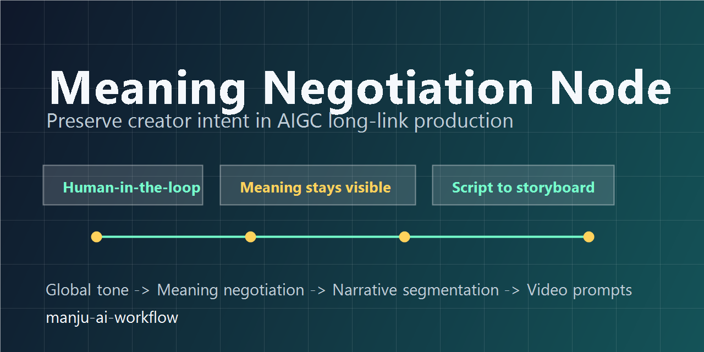
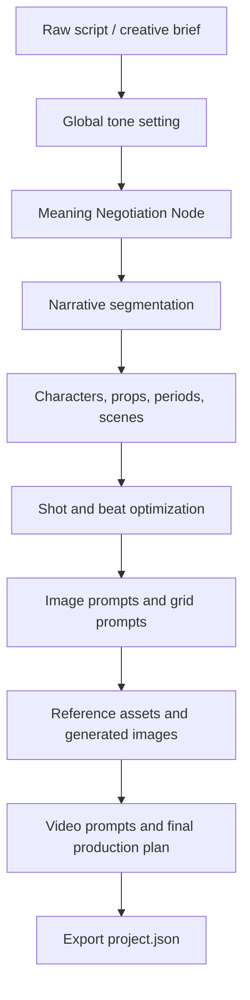

# manju-ai-workflow

[](LICENSE)
[](https://www.python.org/)
[](https://streamlit.io/)



AI long-link production workflow for turning a raw story, script, or creative brief into structured manga / storyboard production data while preserving creator intent through **Meaning Negotiation Nodes**.

`manju-ai-workflow` is based on a research-driven design idea: in AIGC long-link production, creator intent can be silently handed over to algorithmic defaults as text is converted into scenes, assets, shots, images, and videos. This project introduces a practical **意义协商节点 / Meaning Negotiation Node** mechanism so creators can intervene before errors are locked into downstream stages.

Read the concept note: [Meaning Negotiation Node](docs/meaning-negotiation-node.md).

## Core Concept

The system is built around two creator-in-the-loop interventions:

- **Global tone setting before the production chain**: the creator clarifies content type, narrative tone, aesthetic direction, genre expectations, and style orientation before the raw text enters the automated pipeline.
- **Meaning Negotiation Nodes during narrative segmentation**: guided Q&A nodes transform abstract literary intent into concrete visual and narrative judgments that AI modules can reference directly.

This is not just ordinary form filling. The goal is to keep the creator inside the encoding process rather than forcing them to rewrite the original literary text after the final output has already drifted.

## What It Does

- Converts raw scripts or creative briefs into structured story data.
- Adds meaning negotiation nodes for tone, narrative structure, scene logic, character intention, and visual judgment.
- Uses guided Q&A to preserve creator intent without sacrificing the literary quality of the source text.
- Extracts characters, scenes, props, periods, beats, and visual references.
- Generates image prompts for characters, scenes, props, storyboard panels, and shot-level images.
- Optimizes shot fields for manga, storyboard, and AI video production.
- Provides Streamlit workspaces for the original production flow and a newer director-style workflow.
- Integrates optional image/video backends such as LLM chat APIs, GRS-style image APIs, PoloAI video APIs, and ComfyUI.

## Workflow



## Research Background

This repository is connected to a thesis on AIGC long-link production, implicit transfer of meaning, and human-in-the-loop workflow design.

The thesis argues that in one-stop automated novel-to-comic-drama pipelines, creators often remain the nominal encoding subject while the actual judgment work is delegated to algorithmic modules. Upstream errors then become fixed across downstream steps, and creators are forced to rewrite the source text in a more explicit, less literary way so the algorithm can understand it. The proposed **Meaning Negotiation Node** mechanism addresses this by placing creator judgment at key upstream and midstream points.

Research keywords include AIGC, long-link production, media production, human-in-the-loop, encoding/decoding, intersemiotic translation, algorithmic mediation, and meaning negotiation.

## Main Apps

```powershell
streamlit run app.py
```

Runs the full original manga engineering workflow.

```powershell
streamlit run director_app/app.py
```

Runs the newer director workbench, organized around overview, script, assets, storyboard, and final render stages.

```powershell
streamlit run director_app/director_workbench.py
```

Runs the prompt-first director workbench experiment.

## Repository Layout

```text
app.py                         Original Streamlit workflow app
director_app/                  New director-style Streamlit workspace
state/                         Project schema, migration, import/export helpers
script_analyzer.py             Raw script analysis and initial extraction
script_refine.py               Meaning negotiation and script refinement pipeline
script_parser.py               Scene, beat, grid, and asset parsing
asset_manager.py               Character, scene, prop, and reference asset tools
shot_optimizer.py              Shot-field generation and optimization
grid_generator.py              Manga grid / panel prompt generation
video_prompter.py              Video prompt generation for final production
llm.py                         LLM chat API wrapper
image_gen.py                   Image generation wrapper
video_gen.py                   Video generation wrapper
comfyui_api.py                 Optional ComfyUI integration
cfui_wf/                       Example ComfyUI workflow JSON files
```

## Quick Start

```powershell
python -m venv .venv
.\.venv\Scripts\Activate.ps1
pip install -r requirements.txt
Copy-Item .env.example .env
streamlit run app.py
```

Fill `.env` only for the providers you want to use. The app can still be studied and extended without committing any provider credentials.

## Configuration

```env
YUNWU_API_KEY=
YUNWU_CHAT_BASE_URL=https://yunwu.ai/v1/chat/completions
YUNWU_TEXT_MODEL=gpt-5.1

GRSAI_API_KEY=
GRSAI_BASE_URL=https://grsaiapi.com
MANJU_IMAGE_RELAY_BASE_URL=

POLOAI_API_KEY=
POLOAI_HOST=https://poloai.top
MANJU_IMAGE_UPLOAD_SERVER=

COMFYUI_URL=http://127.0.0.1:8188
COMFYUI_INPUT_DIR=
COMFYUI_OUTPUT_DIR=
COMFYUI_CLOUD_BASE=
COMFYUI_WORKFLOW_ID=
```

The open-source release intentionally excludes real API keys, private relay servers, generated images, videos, debug JSON snapshots, logs, local project states, and backup folders.

## Suggested GitHub Topics

`meaning-negotiation`, `meaning-negotiation-node`, `ai-workflow`, `human-in-the-loop`, `aigc`, `long-link-production`, `script-analysis`, `storyboard`, `manga`, `ai-comics`, `prompt-engineering`, `streamlit`, `llm`, `image-generation`, `video-generation`, `comfyui`

## Keywords

Meaning Negotiation Node, AI Q&A system, AIGC long-link production, implicit transfer of meaning, human-in-the-loop, media production, encoding/decoding, intersemiotic translation, workflow automation, manga workflow, storyboard generator, script analysis, script refinement, prompt engineering, character extraction, scene extraction, shot optimization, AI comics, AI storyboard, AI video prompt, ComfyUI workflow.

中文关键词：意义协商节点、AI 问答系统、AIGC 长链路生产、意义的隐性让渡、人在回路、媒介生产、编码解码、符际翻译、流程化工作流、漫画生成、漫画工程、剧本分析、剧本精修、分镜生成、角色提取、场景提取、提示词工程、AI 漫画、AI 分镜、AI 视频提示词、ComfyUI 工作流、创作流程自动化。

## Security Notice

This repository was prepared for public release by moving provider API keys, private upload relays, local ComfyUI paths, and cloud workflow identifiers into environment variables. Any key that existed in local source files before publication should be treated as compromised and rotated at the provider.

## License

MIT
