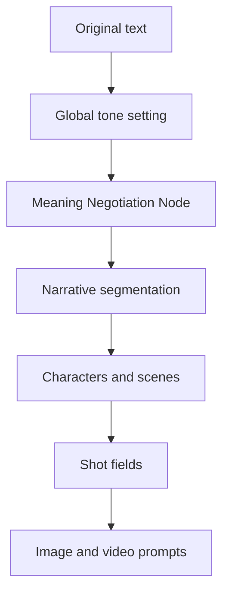

# Meaning Negotiation Node

**Meaning Negotiation Node** is the core workflow concept behind `manju-ai-workflow`. In Chinese, the concept is **意义协商节点**.

It describes a creator-in-the-loop intervention point inside AIGC long-link production. Its purpose is to keep creator intent visible before a story is transformed into downstream structures such as narrative segments, characters, scenes, storyboard shots, image prompts, and video prompts.

## Why It Exists

In one-stop AIGC production, a creator may still appear to be the author or encoding subject, but the actual judgment work can quietly move into algorithmic modules. The system decides how to split the story, how to understand a character, what a scene should look like, and what kind of visual prompt should be generated.

This produces a problem called **implicit transfer of meaning**. The creator's intent is not openly rejected, but it is gradually replaced by model defaults, probability patterns, and upstream parsing decisions.

When the final image or video is wrong, changing the original literary text is usually too late. The creator is forced to make the source text more explicit, less ambiguous, and less literary so the model can understand it. This is not true correction. It is a compromise with the algorithm.

## Mechanism

The project uses two linked interventions:

1. **Global tone setting** before the production chain begins.

The creator defines content type, narrative tone, genre direction, style preference, and aesthetic constraints before the text enters automated processing.

2. **Meaning negotiation during narrative segmentation**.

The system asks guided questions at key story nodes. These questions convert abstract literary intent into concrete visual and narrative judgments that later modules can reuse.

## What The Node Negotiates

- Narrative intention: what the scene is really doing in the story.
- Emotional tone: how the scene should feel, not just what happens.
- Character judgment: what a character wants, hides, fears, or misunderstands.
- Visual priority: which object, gesture, spatial relation, or expression matters most.
- Ambiguity boundary: what should remain suggestive and what must be made explicit for AI generation.

## Workflow Position

## Design Principles

- Intervene upstream before errors become fixed downstream.
- Preserve literary expression instead of forcing the source text to explain itself.
- Make creator judgment explicit without turning the workflow into manual micromanagement.
- Treat the human as an encoding participant, not merely a final reviewer.

## Research Keywords

Meaning Negotiation Node, implicit transfer of meaning, AIGC long-link production, human-in-the-loop, media production, encoding/decoding, intersemiotic translation, algorithmic mediation, script-to-storyboard workflow.

中文关键词：意义协商节点、意义的隐性让渡、AIGC 长链路生产、人在回路、媒介生产、编码解码、符际翻译、算法中介、小说转漫剧、分镜生成、提示词工程。
